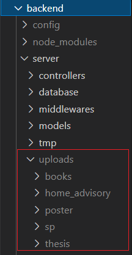

# ICS-Online-Library-System-Project

## About the project
The Institute of Computer Science (ICS) Library System maintains a lot of materials such as Special Problems and thesis of BSCS/MSCS/PhD alumni, books and journals. These materials are used as a reference by current researchers and students. Currently, the only way to access them is through physically visiting the library. With the current pandemic situation and the need for social distancing, there is a need to offer such services online in a secured, efficient, and maintained manner, hence this proposed system.

## Installation
It is required to have an IDE, Visual Studio Code is highly recommended.\
It is also a need to install Git, in order use the Git repository.

Install Node.js [here](https://nodejs.org/en/) and download the latest version of node and install it on your machine.\
Install MongoDB [here](https://www.mongodb.com/try/download/community) and install it on your machine.\
React JS is already part of the directory. 

## Usage
In the project directory, you can run:

### Frontend: `npm start`

Runs the app in the development mode.\
Open [http://localhost:3000](http://localhost:3000) to view it in the browser.

The page will reload if you make edits.\
You will also see any lint errors in the console.

1. cd into frontend
2. Install dependencies: `npm install`
3. start by: `npm start`
4. If react-scripts, axios, yarn are not present in package.json or error persists, run:\
`npm update --force`

### Backend: `npm run dev`

In another terminal do:
1. cd into backend
2. Install dependencies: `npm install`
3. create a folder inside backend named `config`
resulting directory: `backend/config`
4. Inside config, create a file named `dev.env`
5. inside dev.env create/input environment variables needed, sample:

`PORT=5000`\
`MONGODB_URL=mongodb://127.0.0.1:27017/eyecs-db`\
`ACCESS_JWT_SECRET=26b7fe0f39e71bf823e7c57d524c0016f380b2b30a9c`\
`GOOGLE_CLIENT_ID=138358192531-fu4c71u8ev4vbh1mv1aa6ebudt1d7g4h.apps.googleusercontent.com`

6. save dev.env, then start the server by: `npm run dev`

### Additional Notes:

To make the announcement section working:
1. create a folder inside backend/server named `uploads`\
resulting directory: `backend/server/uploads`
2. create subfolders inside that directory named `books`, `home_advisory`,`poster`, `sp`,`thesis`\
resulting directory:\

## Project Link
https://github.com/CMSC128-C3L/ICS-Online-Library-System-Project